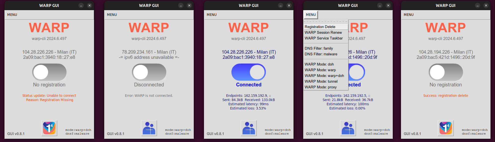
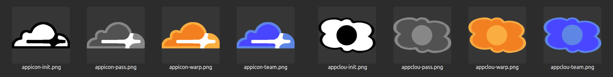

## CloudFlare Graphical User Interface

A python TK graphic interface to manage the CloudFlare WARP+ or Team 
Zero Trust virtual private network (VPN) connection which also offers 
an advertising-free and safe browsing domain name system (DNS).

----

### Pre-requisites

```
sudo apt-get install pip3 python3 python3-tk -y
pip3 install ipinfo requests
```


### Direct execution

The `warp-gui/` folder contains all the stuff needs to run this application

```
python3 warp-gui/warp-gui.py
```

or make it executable and call it directly

```
chmod a+x warp-gui/warp-gui.py
./warp-gui/warp-gui.py
```

Hence the installtion script is checks, copying and creating a desktop icon/link


### Install scripts

For instaling this application, there is a specific script:

```
bash install.sh
```

Then search for **CloudFlare** icon on the desktop and enable it for 
running, using the mouse right button menu.

----

### Update GUI

pull or download from git repository the code and install it again

----

### Install or update warp-cli and/or add certificates

To install and update the `warp-cli` or add certificates, it is required the 
root privileges and it can be used these two scripts:

```
sudo install-ca.sh
sudo install-cf.sh
```

Then you can install this application, if it was not installed yet.

----

### Screenshots

This application allows to dis/connect from both warp and zero-trust team VPNs:



Moreover, it allows to select the DNS filters and the WARP connection mode.

Icon on the taskbar changes with the connection status and the VPN type:



There are two sets of icons: the second one is for Debian integration in "main".

----

## License terms

The project and the installation script are under the very permissive **3-clauses 
BSD license**. While the python application is licensed under **GNU General Public 
License v2** because coding contributions are expected to be given back.

Some images are strictly related with **CloudFlare** trademark and related services 
and cannot be relicensed. However, because this GUI is strictly and exclusively 
related with `warp-cli` and their services, their integration within this project 
can be considered a fair-use as intended in trademark and copyright common laws.

----

## Debian packaging

Debian packages integrators are used to separate software libre from every other 
"**contributes**" or "**non-free**" component. Because the images used by this 
application, are possibly subjected to some restrictions which are incompatible 
with the current "**main**" repository rules, another set of images has been 
added.

When the `orig`folder is missing, then the application falls back searching 
images in the `free` folder. Hence, removing the `orig` folder does not impair the 
functioning of the GUI but it changes its aesthetic, only.

